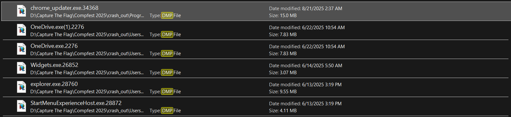
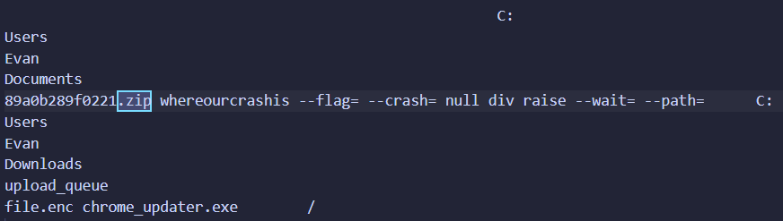
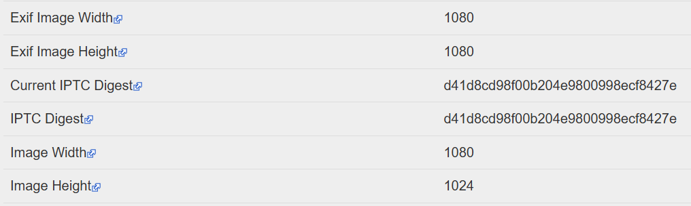

# crash out

### Status : Solved

## Category
Digital Forensic

## Description
Evan installed and executed a supposedly safe file. It caused his laptop to hang, several data to become corrupted, and new password-protected files to show up. The password popped up for a while, but I didn't memorize it. Can you get me back my file?

Attachments : `dump.ad1`

## Solution
I was given AD1 file which can be opened using FTK Imager. I extracted it for easier analysis and found that it contained a dump of the `Windows filesystem`.

In the description, it mentioned that the laptop hung/crash. After some searching, I know that when Windows crashes or hangs, it usually generates a dump file (`.dmp`) to explain the cause. So I looked for dump files and found several of them.



The one that caught my attention was `chrome_updater.exe.34368` because the description: `installed and executed a supposedly safe file`. Somehow I can't open it using `WinDbg` so I use `strings` for analysis instead.

The description also mentioned about `password-protected files`. I assumed this meant a ZIP file.



From the dump, I found a ZIP archive named `89a0b289f0221.zip`, located at `C:\Users\Evan\Documents\`. The password for it was `whereourcrashis`.

Inside of ZIP was a python script:
```python
import sys
import hashlib
import getpass

HEADER_SIZE = 16
def derive_key(password: str, length: int = 32) -> bytes:
    return hashlib.sha256(password.encode()).digest()[:length]

def transform(byte, key_byte, i):
    xored = byte ^ key_byte
    rotation = i % 3
    return ((xored << rotation) | (xored >> (8 - rotation))) & 0xFF

def encrypt(input_file, output_file, password):
    key = derive_key(password)

    with open(input_file, 'rb') as f:
        data = f.read()

    encrypted = bytearray(data[:HEADER_SIZE])

    for i, byte in enumerate(data[HEADER_SIZE:], start=HEADER_SIZE):
        key_byte = key[i % len(key)] ^ (i & 0x0F)
        encrypted.append(transform(byte, key_byte, i))

    with open(output_file, 'wb') as f:
        f.write(encrypted)

    print(f"Encrypted {input_file} -> {output_file}")

if __name__ == "__main__":
    if len(sys.argv) != 4:
        print("Usage:")
        print("python3 script.py encrypt input.jpg output.enc")
        sys.exit(1)

    mode, input_file, output_file = sys.argv[1:4]
    password = getpass.getpass("Enter password: ")

    if mode == "encrypt":
        encrypt(input_file, output_file, password)
    else:
        print("Invalid")
```

This python script encrypts a`.jpg` file into `.enc`. From `.dmp` file analysis earlier, I knew that the encrypted output was named `file.enc` and was stored at `C:\Users\Evan\Downloads\upload_queue\`.

This is the decryption script I used:
```python
import sys
import hashlib
import getpass

HEADER_SIZE = 16

def derive_key(password: str, length: int = 32) -> bytes:
    return hashlib.sha256(password.encode()).digest()[:length]

def rotate_right(val, r_bits):
    return ((val >> r_bits) | (val << (8 - r_bits))) & 0xFF

def decrypt(input_file, output_file, password):
    key = derive_key(password)

    with open(input_file, 'rb') as f:
        data = f.read()

    decrypted = bytearray(data[:HEADER_SIZE]) 

    for i, byte in enumerate(data[HEADER_SIZE:], start=HEADER_SIZE):
        key_byte = key[i % len(key)] ^ (i & 0x0F)
        rotation = i % 3
        rotated = rotate_right(byte, rotation)   
        original = rotated ^ key_byte            
        decrypted.append(original)

    with open(output_file, 'wb') as f:
        f.write(decrypted)

    print(f"Decrypted {input_file} -> {output_file}")

if __name__ == "__main__":
    if len(sys.argv) != 4:
        print("Usage:")
        print("python3 decrypt.py decrypt input.enc output.jpg")
        sys.exit(1)

    mode, input_file, output_file = sys.argv[1:4]
    password = getpass.getpass("Enter password: ")

    if mode == "decrypt":
        decrypt(input_file, output_file, password)
    else:
        print("Invalid")
```

The result was a JPG file. At first glance, I couldn’t see anything that looked like a flag. So I checked the EXIF metadata.



I noticed something weird. Exif height was `1080`, but the actual height was `1024`. I corrected this by editing the bytes at the `FF C0` marker to set the height to `1080`.


## Flag
COMPFEST17{cr4sh1ng_1nt0_th3_v0001d_b00m_boOm_B00M!!_b51a77934b}