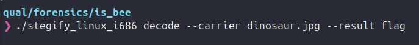
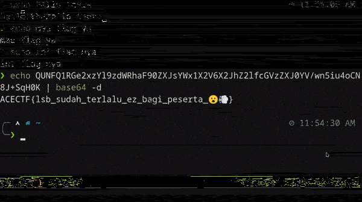

# is bee
## The Ace CTF 2024

This challenge is pretty easy because they provide the solver tools github link on description. Just use that tool to decode dinosaur.jpg.

The output is a gif file that contains flag so i convert it to jpg using online tools like https://www.iloveimg.com/convert-to-jpg/gif-to-jpg.

## Flag
ACECTF {lsb_sudah_terlalu_ez_bagi_peserta😮💨}